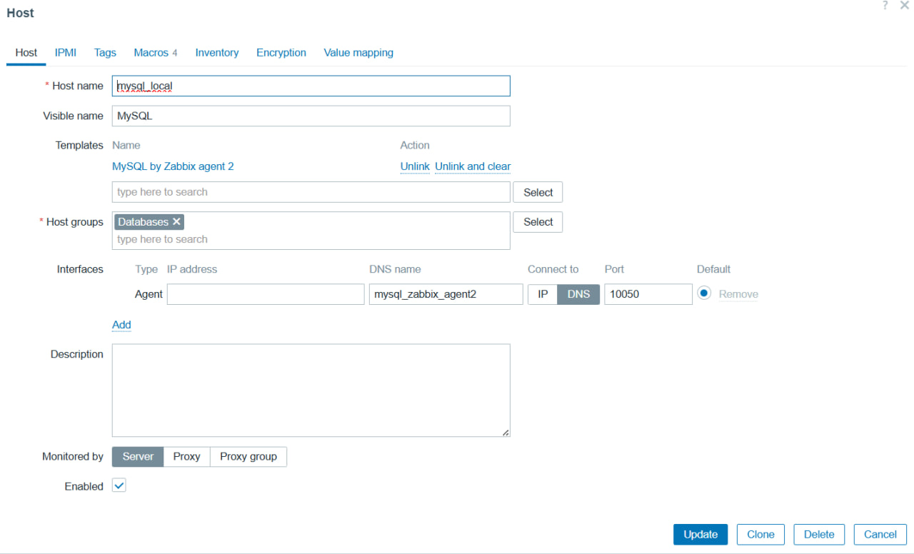
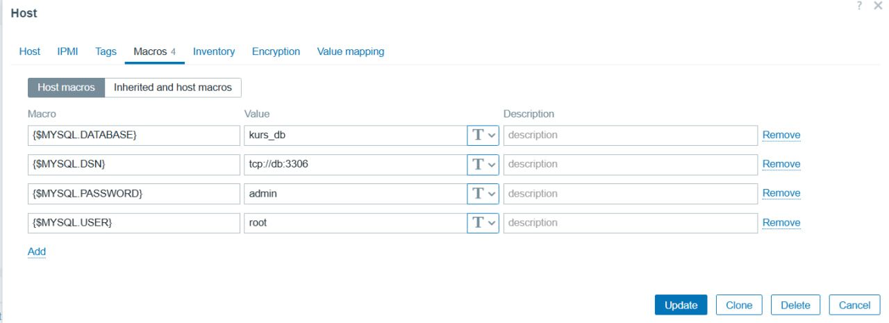

# zabbix_db_monitor — Быстрый запуск (обычная ветка)

Простой пошаговый гайд, чтобы запустить проект локально и попасть в веб-интерфейс Zabbix.

## Требования
- Docker & Docker Compose
- Python 3.8+ (для виртуального окружения и любых вспомогательных скриптов)
- Git (по желанию)

## Быстрый старт

1. Клонируйте репозиторий (если ещё не сделано):
```bash
git clone https://github.com/Substance-live/zabbix_db_monitor.git
cd zabbix_db_monitor
```

2. Создайте виртуальное окружение и установите зависимости:
```bash
python -m venv venv
# Windows
venv\\Scripts\\activate
# Linux/macOS
# source venv/bin/activate

pip install -r requirements.txt
```

3. Запустите контейнеры:
```bash
docker compose up -d
```

4. Откройте веб-интерфейс Zabbix:
```
http://localhost:8080
```

5. Войдите:
- Логин: `Admin`
- Пароль: `zabbix`

## Что сделать в UI (быстрая инструкция)
1. Перейдите в `Monitoring` → `Hosts`.  
2. Удалите дефолтный хост `Zabbix server` (если он мешает вашему тестированию).  
3. Создайте свой хост (Add → Create host).  
   - Ячейки в форме много — я сам(а) добавлю скриншоты и заполню по месту.  
   - Обратите внимание на поле **Host name**: оно должно совпадать с `ZBX_HOSTNAME` в конфиге агента (если вы используете агент-контейнер).  

## Заполнение host


*Рисунок 1. Форма добавления нового хоста в Zabbix.*


*Рисунок 2. Пример заполнения основных полей при создании хоста.*

## Полезные команды
- Просмотр логов Zabbix server:
```bash
docker logs -f zabbix_server
```
- Просмотр логов агента:
```bash
docker logs -f zabbix_agent2
```
- Остановка стека:
```bash
docker compose down
```

## Траблшутинг (быстрые подсказки)
- Если веб-интерфейс не доступен — проверьте `docker compose ps` и логи контейнеров.  
- Если логин не проходит — убедитесь, что контейнеры полностью поднялись (первые старты могут занимать минуту).  
- Если будут вопросы по шаблонам/агентам — откройте логи агента и проверьте совпадение `Host name` в UI и `ZBX_HOSTNAME` в контейнере.

---

Если нужно, могу сразу подготовить файл с рекомендованными шаблонами и макросами для PostgreSQL/других СУБД.
